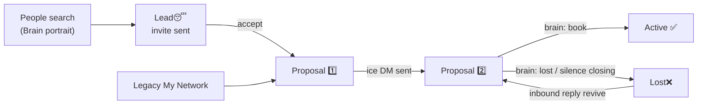

# H.A.L.O. — Headless Automated Lead Operator

Product name: **H.A.L.O.** (Headless Automated Lead Operator).  
Company behind outreach copy remains WAFFi.

# WAFFi Cold Outreach Agent — OVERVIEW

> **Agent knowledge base.** Read this first after any idle period.  
> Keep this file updated whenever behavior, env flags, dashboard UI, or deploy paths change.  
> Last updated: 2026-09-08 (support chat + attention flags, FAQ Contact support drawer, Resend/Telegram alerts).

---

## 1. Purpose

Automated LinkedIn cold outreach for WAFFi:

1. **Stage A** — **Portrait prospecting (recommended):** each run checks `Lead😴` accepts → drains `Proposal 1️⃣` (enrich + ice) → sends **N** connection invites (Brain portrait) → new `Lead😴` rows. **Legacy (toggle off):** My Network sync → enrich → ice.
2. **Stage B** — read replies, LLM-respond, revive Lost leads that messaged back, send silence closings.

**Primary product:** send DMs + read/reply.  
**Outbound connect:** part of Stage A when **Portrait-based prospecting** is ON in LinkedIn dashboard (sets `STAGE_A_OUTBOUND_CONNECT=1`, `STAGE_A_ACCEPTANCE=1`, `STAGE_A_LEGACY_SYNC=0`). See [`ROLLBACK.md`](ROLLBACK.md).

---

## 2. Deploy topology

| Item | Value |
|------|--------|
| VPS | IONOS `31.70.101.111` |
| App root | `/root/cold-outreach-agent` |
| Compose | [`docker-compose.ionos.yml`](docker-compose.ionos.yml) |
| Agent env | `/root/cold-outreach-agent/.env` |
| Local mirror | `c:\Users\micha\OneDrive\Рабочий стол\WAFFi\Cold Outreach Agent\` |

### Docker services

| Service | Container | Role |
|---------|-----------|------|
| `linkedin-agent` | `linkedin-agent` | Playwright agent: Stage A/B scheduler (`node index.js`) |
| `outreach-dashboard` | `outreach-dashboard` | Control UI on `127.0.0.1:3080` |
| `n8n` | `n8n` | Legacy workflows; agent enrich no longer depends on it |

Agent mounts:

- `.:/app` (live code + `.env` + `cookies.json`)
- anonymous `/app/node_modules`
- `./session_data:/app/session_data` (Chromium persistent profile)

Dashboard mounts host tree as `/app-data` (`APP_ROOT`) and Docker socket for agent restart.

### Marketing site (`/marketing`)

`marketing/` is a standalone **React + Vite + Tailwind** port of the Nebulink
Figma template — the only build step in the repo. It is deliberately separate
from `dashboard/public/app.js`, which stays framework-free and build-free.

- `dashboard/Dockerfile` builds it in a first stage (`npm ci && npm run build`)
  and copies the output to `/marketing/dist` in the runtime image.
- `dashboard/server.js` serves that directory at `/marketing` (hashed assets
  cached 1y; `index.html` uncached), with a `/marketing/*` SPA fallback.
- The route is wrapped in an `fs.existsSync` guard, so a dashboard running from
  source without a marketing build simply doesn't expose it — not an error.
- Figma asset URLs expire ~7 days after extraction; every asset is committed
  under `marketing/src/assets/` and mapped in `marketing/assets.manifest.json`.

The port is **incomplete**: Homepage Hero/Features/How-it-Works plus shared
navbar, footer and CTA are done; the remaining sections and 16 inner pages are
routed stubs. See `marketing/README.md` for status and how to resume (blocked on
the Figma MCP Starter-plan cap of 20 calls/month).

### Brain files — deploy vs runtime (VPS-owned)

| File | Deploy from local? | Owner |
|------|-------------------|--------|
| [`brain/user_prompt.md`](brain/user_prompt.md) | **Yes** — when you intentionally change the master prompt | You (dashboard Save) |
| [`brain/strategy_notes.md`](brain/strategy_notes.md) | **Never** | Agent (`brainAnalyzer.js` after each analysis) |
| [`brain/analysis_state.json`](brain/analysis_state.json) | **Never** | Agent (`brainAnalyzer.js` — `lastRunAt`, counts, summary) |

**Rule:** Deploy scripts (`deploy-brain.py`, `deploy-dashboard.py`) must **not** upload `strategy_notes.md` or `analysis_state.json` from the local mirror. Local copies are often empty/stale and will **wipe** live VPS data (including a successful analysis run). If you need to refresh notes after a bad deploy, run `node scripts/run-brain-analysis-once.js` on the VPS (or wait for the next due tick).

Safe to deploy: code (`brainAnalyzer.js`, `brainStore.js`, …), `brain/user_prompt.md` (only when you mean to push prompt changes), dashboard UI.

---

## 3. Notion CRM pipeline (Status glossary — source of truth)

Exact Status select names (emoji matter). **Do not invent extra statuses.**



| Status | Who owns it | Meaning |
|--------|-------------|---------|
| `Lead😴` | **Stage A connect** (portrait mode) or **you (manual + Lead)** | Invite sent / waiting, or manual queue. Profile probe: already connected → `Proposal 1️⃣`; Connect available → invite (counts toward N). **Stage B ignores.** |
| `Proposal 1️⃣` | **Stage A** | Queue for first ice-breaker. Stage A **always drains leftovers first**: enrich if Ice-breaker missing, send ice DM, move to `Proposal 2️⃣`. **Same run never does leftover-DM and a new My Network import** — closing Chromium for Apify then reopening for the next ice kills `li_at` on this VPS. New imports wait until Proposal 1️⃣ ice-ready is empty **and** this run did not already send leftover ice. |
| `Proposal 2️⃣` | **Stage B** | Active conversations after ice was sent. Stage B reads replies, LLM-responds, and may send silence closing. |
| `Active ✅` | **Stage B → then human** | Outcome met (e.g. Book a call: lead accepted a concrete slot). **Automation stops touching them** until you manually move them elsewhere. |
| `Lost❌` | **Stage B** | Brain decided not interested / clear refusal, **or** silence closing was sent. Hundreds of leads may sit here. If a Lost lead later messages us → revive to `Proposal 2️⃣` (reply next Stage B cycle). |

### Status transitions the code writes today

| From → To | When | Code |
|-----------|------|------|
| (new) → `Lead😴` | Connect invite sent (portrait prospecting) | [`connectLeads.js`](connectLeads.js) `upsertLeadSleepPage` |
| `Lead😴` → `Proposal 1️⃣` | Connection accepted | [`stageAConnect.js`](stageAConnect.js) `promoteLeadSleepToProposal1` |
| (new) → `Proposal 1️⃣` | Legacy connections sync creates page | [`connectionsSync.js`](connectionsSync.js) `createNotionLead` |
| `Proposal 1️⃣` → `Proposal 2️⃣` | Ice DM successfully sent | [`index.js`](index.js) `runStageA` |
| `Lost❌` → `Proposal 2️⃣` | Lost revive sees inbound | [`index.js`](index.js) `runStageB` |
| `Proposal 2️⃣` → `Active ✅` / `Lost❌` / stay P2 | Inbox LLM decision | [`salesBrain.js`](salesBrain.js) / [`conversationAgent.js`](conversationAgent.js) |
| `Proposal 2️⃣` → `Lost❌` | Silence closing sent | [`index.js`](index.js) silence loop |

**Not in code (do not use):** `Proposal Sent ✅` — never written by the agent. If it appears in Notion, delete that select option; after ice send the status must be `Proposal 2️⃣` only.

### Stage B inbox rules (implemented)

1. Primary inbox work = leads in `Proposal 2️⃣` (LLM reply).
2. Scrape LinkedIn messaging list; **notify only on unread** (CRM or not). Already-read chats where the lead spoke last are ignored. Deduped per sender+preview. **Sponsored/ad unreads are ignored** (never notified or replied). Inbox is still checked every Stage B tick; sponsored-only does not delay the next tick.
3. Unknown / not in CRM → **never auto-reply**.
4. `Lost❌` + unread → revive to `Proposal 2️⃣`; reply next cycle.

### Properties used in code

| Property | Usage |
|----------|--------|
| `Name` | Title; send requires `name.length >= 2`; Lost revive / inbox match |
| `Link` | LinkedIn profile URL |
| `Status` | Pipeline filter (only the five statuses above) |
| `Ice-breaker` | Stage A message body |
| `Processing at` | Last-outbound clock for silence closing |

Page body notes: [`notionNotes.js`](notionNotes.js) (`appendPageNote` / `readPageBodyText`).

Env: `NOTION_TOKEN`, `NOTION_DATABASE_ID`, optional `NOTION_CRM_URL`.

---

## 4. Stage A — Acquisition (full cycle)

**Entry:** [`index.js`](index.js) → `runStageA()`  
**Scheduler:** `tickStageA` / due via [`stageAState.js`](stageAState.js) + `stage_a_state.json`  
**Default interval:** `STAGE_A_INTERVAL_MS` = 48h (`172800000`)

### Guards (any one skips)

- `OUTREACH_PAUSED=1`
- `SKIP_STAGE_A=1`
- `CHANNEL_LINKEDIN_ENABLED=0`

### Step-by-step

```
processLeads / tickStageA
  → cycleLock.js withCycleLock('A')
  → runStageA
```

### Step-by-step (portrait prospecting ON)

| # | Phase | What happens | Code |
|---|--------|--------------|------|
| 0a | Acceptance | `Lead😴` CRM Links → profile probe (Connect/Pending/Message); My Network fallback → promote accepts to `Proposal 1️⃣` | `runStageAAcceptancePhase` |
| 0b | Leftover drain | All existing `Proposal 1️⃣`: enrich if ice missing, send ice → `Proposal 2️⃣` | `runStageA` |
| 1 | Connect | Manual `Lead😴` without prior invite (profile Connect) then People search (Brain) → up to **N** Connects → new `Lead😴` | `runStageAConnectPhase` |
| — | Legacy sync | **Skipped** when portrait prospecting ON | — |

**N** = dashboard **Connection invites per Stage A** → `CONNECT_MAX_PER_RUN` (recommended **15**/run; UI max **100**). Acceptance: profile probes up to `ACCEPTANCE_PROFILE_MAX` (default **120**); My Network fallback scroll `ACCEPTANCE_SCROLL_CAP` (default **80**) only for unresolved leftovers — does **not** cap outbound invites.

### Step-by-step (legacy — prospecting OFF)

| # | Phase | What happens | Code |
|---|--------|--------------|------|
| 0 | Leftover drain | All existing Proposal 1️⃣: enrich if ice missing, send ice, move to Proposal 2️⃣. **Not limited by `SYNC_MAX_NEW`.** New My Network import waits until ice-ready leftovers are gone. | `runStageA` |
| 0b | Optional short-circuit | Apify enrich, then **continues** to leftover ice send in the same Stage A (unless `SKIP_SEND=1`) | `ENRICH_ONLY=1` → [`enrichAndWrite.js`](enrichAndWrite.js) then browser ice loop |
| 1 | Session | Launch persistent Chromium, load `cookies.json`, open feed, mark session ok/dead | `ensureLoggedInBrowser`, [`sessionHealth.js`](sessionHealth.js) |
| 2 | Sync | My Connections → create Notion pages as Proposal 1️⃣ (only after leftover ice-ready P1 is empty) | [`connectionsSync.js`](connectionsSync.js) `syncNewConnections` |
| 2b | Early exit | Stop after sync | `SYNC_CONNECTIONS_ONLY=1` |
| 3 | Enrich | Apify profile scrape + LLM ice-breaker → write Name + Ice-breaker | `enrichProposal1Leads`, [`salesBrain.js`](salesBrain.js) |
| 4 | Select | Proposal 1️⃣ with real ice (`hasRealIceBreaker`) | [`messageQuality.js`](messageQuality.js) |
| 5 | Cap | Optional send cap | `STAGE_A_SEND_MAX` (0 = unlimited). **Leftover P1 drain is not limited by `SYNC_MAX_NEW`.** |
| 6 | Send | Open profile → Message → paste ice → Send | `sendMessageToLead` |
| 7 | CRM | `Processing at` now + Status → Proposal 2️⃣ + page note | `setProcessingAt`, `updateNotionStatus` |
| 8 | Due clock | Mark Stage A ran **only if** no ice-ready leftover remains in Proposal 1️⃣ and session is alive | `markStageARan` |
| 9 | Close | Persist cookies **only if** live context still has `li_at` and session not dead | `persistSessionCookies`, `closeBrowser` |

### Sync intake model ([`connectionsSync.js`](connectionsSync.js))

- **No gaps:** Notion `Link` = already synced; every My Connections profile not in CRM is a candidate
- Scroll from top (Recently added); import **oldest-first among visible unknowns** (frontier toward synced zone — not newest-first)
- Stop when batch has `SYNC_MAX_NEW` unknowns, list ends, or scroll cap; **extend** toward `SYNC_MAX_SCROLLS` when scrolling through a long CRM-known prefix
- Soft cursor when found still helps; missing deep cursor does **not** block imports
- Each Stage A run imports up to dashboard cap; backlog visible in window waits for the next run (`backlogAfter` in logs)

**Dashboard rule:** Sync cap (`SYNC_MAX_NEW`) cannot exceed `SYNC_MAX_SCROLLS` (UI `max` + server clamp).

### Enrich stack

- Apify actor: `APIFY_ACTOR` default `apimaestro~linkedin-profile-detail`
- Tokens: `APIFY_TOKEN` / `APIFY_TOKEN_1` / `APIFY_TOKEN_2`
- Cap: `ENRICH_MAX_PER_RUN`
- LLM cascade: OpenAI → Gemini → Cohere ([`salesBrain.js`](salesBrain.js))
- System prompt: [`brain/user_prompt.md`](brain/user_prompt.md) + optional [`brain/strategy_notes.md`](brain/strategy_notes.md) + [`prompts/ice_breaker.md`](prompts/ice_breaker.md) (see §6 Brain)

---

## 5. Stage B — Conversation

**Entry:** `runStageB()` in [`index.js`](index.js)  
**Interval:** `STAGE_B_INTERVAL_MS` default 30m (`1800000`), plus **±1–5 min random jitter** per cycle ([`stageBState.js`](stageBState.js) → `stage_b_state.json`: `nextBrowserDueAt`, `lastScheduledGapMs`). Dashboard enforces **min 6 minutes** for the base interval.

### Guards

- `OUTREACH_PAUSED=1`
- `SKIP_STAGE_B=1` **or** `SKIP_CONVERSATION=1`
- `CHANNEL_LINKEDIN_ENABLED=0`

### Auto-dialog (always on)

Stage B **auto-dialog is core automation** — not optional in the dashboard. Every save forces `ENABLE_INBOX_REPLIES=1` ([`dashboard/lib/ops.js`](dashboard/lib/ops.js)). LinkedIn page shows an **Auto-dialog** info tile (no toggles/caps).

- **Inbox replies:** all **unread** `Proposal 2️⃣` threads detected in the messaging scrape are answered in the same browser run (no `CONV_MAX_PER_RUN` UI cap; env var legacy only).
- **Lost revive:** **all** unread `Lost❌` senders in CRM are revived to `Proposal 2️⃣` and queued for reply (no `LOST_INBOX_MAX` UI cap).

### Order (strict)

1. **Inbox name-revive** — scrape messaging list (`scrapeInboxConversations`); resolve non-P2 senders via Notion name search (`findLeadsByName` / `namesMatch`); **all** Lost + inbound → Proposal 2️⃣ + refresh `Processing at`; **no reply same cycle**. Unread unknown (not P2/Lost) → notify only. Skipped if `TARGET_LINKEDIN_URL` set.
2. **Inbox replies** — **all unread** Proposal 2️⃣ in queue (`collectUnreadP2Leads`); LLM JSON from [`prompts/reply.md`](prompts/reply.md) via [`conversationAgent.js`](conversationAgent.js); may move to Active / Lost / stay P2. Opens desktop messaging threads only (unread-known); `STAGE_B_SCAN_ALL_P2=1` debug scans every P2 via composer.
3. **Silence closing** — business days since `Processing at` ≥ `SILENCE_BUSINESS_DAYS` (default 2); optional skip weekends (`SILENCE_SKIP_WEEKENDS`); send closing → Lost❌ (cap `STAGE_B_SILENCE_MAX`, default 2).

Thread scrape prefers mwlite message DOM (`scrapeThreadMessages`). Inbound detection is conservative (`threadHasInbound`).

Notion page notes after send store **full** ice / inbound+reply / closing text (chunked by `appendPageNote`), so Brain and reply modes can read the full conversation from the page body.

---

## 6. Brain (copy generation + strategy analysis)

Dashboard nav **Brain** (pinned bottom of sidebar, rotating green glow): compact **Your prompt** + analysis settings. **Strategy notes** are collapsible (read-only). Mode adapters (`prompts/*.md`) are internal — not edited in the UI.

| File | Role |
|------|------|
| [`brain/user_prompt.md`](brain/user_prompt.md) | Sole user-editable master instruction (migrates from `salesPlaybook.md` if empty) |
| [`brain/strategy_notes.md`](brain/strategy_notes.md) | Living add-on rewritten by periodic analysis (**VPS runtime — do not deploy from local**) |
| [`brain/analysis_state.json`](brain/analysis_state.json) | `lastRunAt`, counts, summary (**VPS runtime — do not deploy from local**) |
| [`prompts/*.md`](prompts/) | Mode adapters: `ice_breaker`, `reply`, `closing_followup` |

**Compose** ([`salesBrain.js`](salesBrain.js) → `generateSalesMessage` via [`brainStore.js`](brainStore.js) `composeBrainSystem`):

```text
brain/user_prompt.md
+ prompts/<mode>.md
+ brain/strategy_notes.md   (if non-empty)
```

**3-role pipeline** (default when keys exist; `BRAIN_PIPELINE=0` disables):

| Role | Provider | Job |
|------|----------|-----|
| Researcher | `GEMINI_API_KEY` | Extract gold nugget / friction / angle (no full DM) |
| Copywriter | `GEMINI_API_KEY_2` (falls back to key 1) | Write using composeBrainSystem + researcher brief |
| Inspector | `COHERE_API_KEY` (Gemini fallback) | Humanize / reject templates; same output contract |

Callers (`enrichAndWrite`, `conversationAgent`) still only call `generateSalesMessage` — Playwright / Stage A/B unchanged. On pipeline failure → legacy OpenAI→Gemini→Cohere single-shot.

**Brain Sales block** ([`brain/sales_policy.json`](brain/sales_policy.json)):

| Block | Used for People search? | Used for reply LLM? |
|-------|-------------------------|---------------------|
| **LinkedIn People filters** (connection degree, extra keywords, company, school, language) | **Yes** → [`prospectSearch.js`](prospectSearch.js) |
| **Who** (roles, industries, company size, decision maker) | Roles/industries → keywords; size → keyword hint | Reply scoring |
| **Context** (stage, budget, regions, urgency) | Regions → `geoUrn` facets ([`regionsGeo.js`](regionsGeo.js)); aliases (e.g. US→USA, UK) | Reply scoring |
| **Fit signals** (pain, LinkedIn signals, need) | No (reply only) | Reply scoring |
| **Disqualifiers** | No | Reply → Lost rules |
| **Outcome** (`book_a_call` / purchase / qualify / referral) | No | Reply → Active rules |
| **Booking schedule** (`booking` weekly availability) | No | Reply when outcome = `book_a_call` |
| **URL override** | Replaces auto-built URL (exact LinkedIn facets from browser) | — |

### Book a call (token-light)

Stored in `sales_policy.json` → `booking` (host timezone + mon–sun: `free` / `busy` / `intervals`). **Default = free 24/7** until the user edits the Brain popup (⚙ on Book a call).

Runtime ([`bookingSchedule.js`](bookingSchedule.js) + [`salesBrain.js`](salesBrain.js)):

1. Soft “yes to a call” ≠ Active — stay Proposal 2️⃣ and propose **1–2 precomputed slots**.
2. Slots are built server-side from host availability, labeled in **lead CRM timezone** (no LLM inventing times). Only ~5 offers injected into the reply user prompt.
3. Lead accepts a listed slot (`booked_slot_id`) → **Active ✅**.
4. Optional **Google Meet room URL** (Brain → Book a call ⚙ → `GOOGLE_MEET_URL`): append Meet link in the outbound DM **only after** slot accept. No Calendar OAuth.
5. On **Active ✅**, Telegram notifies with host/lead times + a one-tap **Add to Google Calendar** template link ([`googleCalendar.js`](googleCalendar.js) `buildGoogleCalendarAddUrl` / `notifyBookedCall`).

Dashboard: Brain popup for weekly availability + Meet URL. FAQ: **Book a call outcome**.

LinkedIn filter mapping (auto URL):

| LinkedIn UI filter | Brain control |
|--------------------|---------------|
| Keywords | Roles + industries + stage/size + extra keywords + company/school text |
| Connections (2nd / 3rd+) | **Connections** chips → `network` facet |
| Locations | **Regions** chips (groups + countries) + **Additional regions** text → `geoUrn` via [`regionsGeo.js`](regionsGeo.js) |
| Profile language | **Profile language** select → `primaryLanguage` |
| Current / past company, school | Text fields (keywords); for entity URNs use **URL override** |
| Industry (strict URN facet) | Industries chips → keywords; or **URL override** |

Preview on Brain page: **URL override** field only (duplicate auto-built Keywords/Connections/Location summary removed 2026-08-28). Portrait + LinkedIn People filters below still drive auto URL when override is empty.

**Regions catalog** ([`regionsGeo.js`](regionsGeo.js)): broad groups (North America, Europe, DACH, Nordics, …), individual countries, and free-text **Additional regions** (comma-separated, alias-normalized). Shared by agent ([`prospectSearch.js`](prospectSearch.js), [`brainStore.js`](brainStore.js)) and dashboard chip picker.

**Analysis tick** ([`brainAnalyzer.js`](brainAnalyzer.js) + `tickBrainAnalysis` in [`index.js`](index.js)):

- No LinkedIn browser — Notion + LLM only
- Acquires [`cycleLock.js`](cycleLock.js) as `Brain` (`skipIfBusy: false`, waits like Stage A) so it never overlaps Stage A/B
- Interval = lookback: `BRAIN_ANALYSIS_INTERVAL_MS` (default **7 days**). Due when `now - lastRunAt ≥ interval`; Notion filter `Processing at ≥ now − interval`
- Status ∈ `Proposal 2️⃣`, `Lost❌`; one lead per LLM call; rewrite `strategy_notes.md` as one living block
- Env: `BRAIN_ANALYSIS_ENABLED` (`0` off), `BRAIN_ANALYSIS_INTERVAL_MS`, optional `BRAIN_ANALYSIS_INTERVAL_UNIT` for dashboard display

**Deploy pitfall (2026-08):** Uploading empty local `strategy_notes.md` / `analysis_state.json` during dashboard deploy erased VPS notes and reset `lastRunAt` while notifications still showed “Strategy notes updated”. See §2 Brain files — deploy vs runtime.

See also §7 for `li_at` kill causes (Brain must never open LinkedIn).

---

## 7. Session & cookies (critical)

| Artifact | Path | Role |
|----------|------|------|
| Cookie jar | `cookies.json` | Must include `li_at` |
| Chromium profile | `session_data/` | Persistent Playwright context |
| Health | `session_status.json` | `{ ok, reason, needsCookieRepair, … }` |
| Optional | `state.json` | storageState if present |

### Rules

1. **`ALLOW_AUTO_LOGIN` must stay `0`.** Password login from VPS rotates tokens and kicks the real browser.
2. **Never persist cookies without live `li_at`.** `persistSessionCookies` skips write if `li_at` missing (keeps last good `cookies.json`).
3. **Fresh paste:** clear Chromium cookie DB under `session_data` (or `mv session_data → bak` + empty dir) so dead profile cookies don’t override new `li_at`.
4. **One browser session per cookie paste.** Don’t run Connect oneshots + DM agent in parallel on same account.
5. Datacenter IP often burns `li_at` after 1–2 automation sessions → paste fresh EditThisCookie export.
6. After paste: user closes LinkedIn tab immediately; agent must **not** run a separate probe browser (burns `li_at`).

### Known `li_at` kill causes (do not repeat)

Confirmed in production runs — add new ones here when discovered:

| Cause | Why it kills | Mitigation |
|-------|--------------|------------|
| Parallel login (phone/desktop) while agent holds session | LinkedIn invalidates concurrent sessions | Do not open that account until the run finishes |
| Separate probe browser before Stage A/B | Extra Chromium fingerprint burns token | Apply cookies → wipe `session_data` → run real Stage only |
| Long My Network scroll / high scroll budget | Heavy browse looks automated; session dies before send | Safety cap **≤ 18 scrolls** (`SYNC_SAFE_SCROLL_CAP`); new leads per cycle **1–3** |
| **Save and restart running Stage A ∥ Stage B** | Two LinkedIn sessions at once → auth wall | **Sequential only:** A finishes, then B; cycle lock enforces one at a time |
| Browser left open during Apify enrich | Background keepalive + long idle invalidates cookies | Close browser for enrich, reopen for DM (Stage A pause/resume) |
| Visiting `/in/` public profiles for DM | Guest auth wall / session challenge | Compose-by-name via `/messaging/compose` only |
| Stage B opening **mwlite** profile/thread for every P2 | Auth wall mid-cycle; live context loses `li_at` | Desktop messaging Unread filter; P2 **unread-only**; abort on auth wall |
| Persisting cookies from a dead context | Overwrites good jar with empty/`li_at`-less set | Skip persist when no live `li_at` |
| Stage B scanning **all** P2 via profile composer every tick | Many profile navigations → auth wall | Unread-only P2 opens (`STAGE_B_SCAN_ALL_P2=1` only for debug) |

Dashboard paste: [`dashboard/lib/ops.js`](dashboard/lib/ops.js) `ingestCookiePaste` (EditThisCookie JSON or raw `li_at`).

---

## 8. Scheduler, locks, one-shots

**One automation at a time (critical on ~4 GB VPS):** only **one** Chromium-bearing job may run — Stage A, Stage B, Connect one-shot (`C`), Brain analysis, or Sign-in repair (`R`). Never parallel `linkedin-agent` + `linkedin-repair` + `connect-test-*`. The scheduler uses `cycle.lock`; dashboard Sign-in and connect scripts refuse to start if the lock or a connect container is active. During manual one-shots, stop `linkedin-agent` (and `n8n` for connect tests).

| Mechanism | File | Behavior |
|-----------|------|----------|
| Stage A due | `stageAState.js` | Elapsed ≥ interval or `FORCE_STAGE_A=1` |
| Cycle lock | `cycleLock.js` + `cycle.lock` | A / Brain wait (`LOCK_WAIT_MS`); B / C skip if busy; repair (`R`) skips if busy; stale >3h cleared; owners `A`\|`B`\|`C`\|`Brain`\|`R` |
| B vs A | `tickStageB` | Skip B while A holds lock |
| Stage B idle skip | `stageBState.js` + Notion preflight in `runStageB` | **Tick** = dashboard `STAGE_B_INTERVAL_MS` **±1–5 min jitter** (`nextBrowserDueAt` in `stage_b_state.json`). Min interval **6 min** in UI. Chromium opens when inbox scan due **or** silence closings due, and cooldown elapsed. Optional floor: `STAGE_B_BROWSER_MIN_MS` (>0) raises minimum gap between browser opens. Silence capped by `STAGE_B_SILENCE_MAX` (default **2**). |
| Brain analysis | `tickBrainAnalysis` | Due on `BRAIN_ANALYSIS_INTERVAL_MS`; waits for lock then runs analyzer |
| Save and restart | `force_run_once.json` + boot in `index.js` | **Save** writes settings only. **Save and restart** (mobile **Restart**) saves first, recreates agent, then runs **enabled** stage(s) once: both on → A then B; one on → that stage only; paused → restart only. After the one-shot, normal intervals apply. |

One-shot routing via `processLeads()`:

- `FORCE_STAGE_A=1` / `STAGE_A_ONLY=1`
- `STAGE_B_ONLY=1`
- `ENRICH_ONLY=1` — Apify enrich, then **continues** to leftover ice send in same Stage A (use `SKIP_SEND=1` to stop after enrich)
- `SYNC_CONNECTIONS_ONLY=1` / `FORCE_SYNC=1`

Example Stage A oneshot (VPS, agent stopped):

```bash
docker run --rm --name linkedin-stage-a-once \
  --env-file /tmp/linkedin-stage-a.env \
  -v /root/cold-outreach-agent:/app \
  -v /root/cold-outreach-agent/session_data:/app/session_data \
  -v <node_modules_volume>:/app/node_modules \
  --shm-size=1gb -w /app <image> \
  node -e "import('./index.js').then(m=>m.processLeads())"
```

After changing `.env`, **recreate** agent (`docker compose … up -d --force-recreate linkedin-agent`) — `docker start` alone keeps old container env.

---

## 9. Dashboard

SPA shell: [`dashboard/public/index.html`](dashboard/public/index.html) + [`dashboard/public/app.js`](dashboard/public/app.js)  
API: [`dashboard/server.js`](dashboard/server.js)  
Ops: [`dashboard/lib/ops.js`](dashboard/lib/ops.js)  
Analytics: [`dashboard/lib/analytics.js`](dashboard/lib/analytics.js) → `GET /api/analytics/series`

**Branding:** **Built by WAFFi** footer card — logo, “Web agency” tagline, link to [waffiweb.com](https://waffiweb.com); gold accent + shine animation on hover (`/waffi-logo.png`). H.A.L.O. = product; WAFFi = agency.

### Pages

1. **Dashboard** — master pause, Stage A/B toggles + intervals (Stage B min **6 min**, jitter hint), silence, channels (LinkedIn: **Connection invites per Stage A**), **analytics chart** (Pipeline / Outreach / Session tabs, 7d–90d range, smooth curves + metric toggles)  
2. **CRM** — Notion status counts  
3. **LinkedIn** — session + cookie paste, **Stage A prospecting** (one toggle + invite cap), **Auto-dialog** info (always on), test URL filter  
4. Instagram / Facebook — coming soon  
5. **Integrations** (key icon) — API keys, Telegram  
6. **Brain** (pinned bottom nav) — master prompt carousel, **Sales** (portrait + LinkedIn People filters + URL override + outcome; **Book a call** ⚙ availability + Meet URL), Learning (analysis + strategy notes)  
7. **FAQ** — setup guide + tiles (includes Book a call)

### Analytics panel (Dashboard)

| Tab | Metrics | Source |
|-----|---------|--------|
| **Pipeline** | Lead😴, P1, P2, Active, Lost | CRM history snapshots |
| **Outreach** | Inbound unread, connect invites, CRM imports, Brain runs | `notifications.json` events |
| **Session** | Session ok / dead events | notifications |

Chart: Catmull-Rom smooth lines, gradient fills, toggleable metric chips. Collect history by opening Dashboard periodically.

### Numeric settings UX (2026-08-28)

**Connection invites per Stage A** (`dashConnectInvites` ↔ `connectInvitesPerRun`) and **New leads per cycle** (legacy env only, if inputs present): **save on blur/change**, not debounced mid-typing. Empty field while editing is allowed; invalid/empty on blur restores last saved value. Focused input is never overwritten by API sync. Safe range warning at **>3**.

### Stage A prospecting UI (LinkedIn page)

| Control | Env flags set |
|---------|----------------|
| **Portrait-based prospecting** ON | `STAGE_A_OUTBOUND_CONNECT=1`, `STAGE_A_ACCEPTANCE=1`, `STAGE_A_LEGACY_SYNC=0` |
| **Portrait-based prospecting** OFF | `STAGE_A_OUTBOUND_CONNECT=0`, `STAGE_A_LEGACY_SYNC=0` — **no new lead intake** (connect + legacy My Network both off); Stage A only drains existing `Proposal 1️⃣` |
| **Connection invites per Stage A** | `CONNECT_MAX_PER_RUN` |

Acceptance monitoring is **not** a separate toggle — it runs at the start of every Stage A while prospecting is ON.

Legacy My Network import (`STAGE_A_LEGACY_SYNC=1`, `SYNC_MAX_NEW`) is **env-only** — removed from dashboard UI (2026-08-28). Production VPS runs portrait mode (`STAGE_A_LEGACY_SYNC=0`).

### Auth & authorization (2026-09-09)

Two ways in, resolved **once** per request by `resolveRequestTenant`
([`dashboard/lib/tenantAuth.js`](dashboard/lib/tenantAuth.js)):

1. **Cabinet session cookie** `halo_session` — HMAC-signed with
   `HALO_SESSION_SECRET` (>= 32 chars; auto-generated into `.env` on first boot).
   There is **no** hardcoded fallback secret and `DASHBOARD_PASSWORD` is never
   reused as the signing key.
2. **Basic auth** `DASHBOARD_USER` / `DASHBOARD_PASSWORD` → WAFFi workspace
   `default`, `role: owner`.

**Fails closed.** With no session and no valid Basic credentials the request is
refused. An unset `DASHBOARD_PASSWORD` no longer serves the dashboard openly.

Refusal shape matters: `/api/*` gets JSON `401`; a browser navigation gets
`401` + `WWW-Authenticate` when `DASHBOARD_PASSWORD` is set (so Chrome shows its
credential prompt — a `302` with that header is silently ignored by browsers),
and a redirect to `/login.html` otherwise. **Operator login is HTTP Basic, not
the `/login.html` form** — that form is for Supabase cabinet accounts and
requires a `halo_tenants` row.

| Surface | Who |
|---------|-----|
| `/api/crm/*` | Any signed-in cabinet, scoped to its own `workspace_id` |
| `GET /api/settings` | Any cabinet — **non-owners get a redacted view** (no prompts, Brain policy, integration keys, session state, infra URLs, host paths, notifications) |
| `POST /api/settings`, `/api/settings/switches` | Any signed-in cabinet — writes are cabinet-scoped (Brain, prompts, stage flags, cookies under `tenantPaths(ws)`). `applyDashboardPatch(..., { isOwner })` refuses integration keys + Notion CRM URL for non-owners |
| `/api/notifications*` | Any signed-in cabinet — per-cabinet store |
| `/api/secrets/reveal`, `/api/agent/restart`, `/api/linkedin/session/login`, `/api/linkedin/repair/link`, `/api/notion/*`, `/api/supabase/*`, `/api/analytics/series`, `/api/supabase/keepalive` | **`role === 'owner'` only** (`requireOwner`) |

**Per-cabinet files (2026-09-12).** `cabinetPaths(ws)` in
[`dashboard/lib/ops.js`](dashboard/lib/ops.js) maps a workspace to its Brain,
prompts, `salesPlaybook.md` and playbook paths: the WAFFi `default` cabinet keeps
the legacy `APP_ROOT` locations, every other cabinet gets
`halo-tenants/<ws>/{brain,prompts}`. `ensureTenantRuntime` seeds a new cabinet
with a **neutral** starter prompt (never WAFFi's master prompt) and copies the
mode adapters. `buildSettingsView(ws)` and `applyDashboardPatch(...)` are now
**async** — the People-search preview imports `prospectSearch.js` in-process
instead of spawning a Node process per request.

Still WAFFi-only at runtime: the single `linkedin-agent` container and
`cycle.lock`. A tenant can configure a cabinet fully, but no Stage A/B runs for
it until per-tenant agents exist.

`POST /api/secrets/reveal` returns values **only** for keys the Integrations UI
renders a reveal button for (derived from `INTEGRATION_DEFS`). Stripe keys,
`LINKEDIN_PASSWORD`, `NOTION_TOKEN`, `DASHBOARD_PASSWORD`, and
`HALO_SESSION_SECRET` are never returned.

**Stripe webhook** `/api/billing/webhook` is public (Stripe is unauthenticated),
so the signature *is* the auth. It is registered **before** `express.json()` and
verified against the raw body with `STRIPE_WEBHOOK_SECRET` (scheme v1, 300s
tolerance). Unset secret → `503`; bad signature → `400`. Do not move this route
below the JSON body parser — re-serialized JSON will not match the signature.

Rate limits: login 10 / 15 min / IP, register 5 / hr / IP.

### Key APIs

| Path | Role |
|------|------|
| `GET/POST /api/settings` | Read/write settings → `.env` / prompts / cookies |
| `GET /api/analytics/series?tab=&range=` | CRM + notification time series for dashboard chart |
| `GET /regions/catalog.js` | Region chip catalog for Brain portrait picker |
| `POST /api/settings/switches` | Fast toggles |
| `GET /api/notion/counts` | Status counts |
| `POST /api/agent/restart` | Recreate agent after **Save** persisted settings; optional one-shot run of **enabled** stage(s) via `force_run_once.json` — both on → A then B (sequential); one on → that stage only; paused → restart only |

Auth: Basic `DASHBOARD_USER` / `DASHBOARD_PASSWORD`.

**Access:** dashboard binds `127.0.0.1:3080` on the VPS (not public by default).

- Always-on (preferred): Cloudflare quick tunnel container `dash-cf-tunnel` → public `https://….trycloudflare.com` (URL changes if that container is recreated).
- Local SSH: run [`scripts/keep-dashboard-tunnel.py`](scripts/keep-dashboard-tunnel.py) (auto-reconnect) or [`scripts/ssh-tunnel-dashboard.py`](scripts/ssh-tunnel-dashboard.py), then open **http://127.0.0.1:3080/**.

### Notifications

Dashboard + agent store `notifications.json`. Items older than **14 days** are deleted on read/write (`dashboard/lib/notifications.js`, `notify.js`).

### Legacy sync (env-only, 2026-08-28)

My Network import cap UI removed from dashboard. When needed (rollback/debug), set on VPS:

- `STAGE_A_LEGACY_SYNC=1` — enable My Network → `Proposal 1️⃣` import
- `SYNC_MAX_NEW` — batch size (safe **1–3**)
- **Scrolls ≠ batch size.** Effective scroll cap = `min(SYNC_MAX_SCROLLS, SYNC_SAFE_SCROLL_CAP, 8+4N)` with `SYNC_SAFE_SCROLL_CAP` default **18**

[`connectionsSync.js`](connectionsSync.js) name extraction (2026-08-28): cleans LinkedIn card text (`View …'s profile`, degree suffixes, `•` subtitles) so acceptance sync and legacy import write real **Name** titles.

---

## 10. Env quick reference

### Master

| Flag | Effect |
|------|--------|
| `OUTREACH_PAUSED` | `1` = all outreach off |
| `SKIP_STAGE_A` | Skip Stage A |
| `SKIP_STAGE_B` / `SKIP_CONVERSATION` | Skip Stage B |
| `CHANNEL_LINKEDIN_ENABLED` | Channel kill switch |
| `ALLOW_AUTO_LOGIN` | **Keep `0`** |

### Stage A / sync

| Flag | Default | Effect |
|------|---------|--------|
| `STAGE_A_INTERVAL_MS` | 48h | Due interval |
| `STAGE_A_SEND_MAX` | 0=all | Ice DM cap |
| `SYNC_MAX_NEW` | 20 | Legacy My Network batch (**env-only**; safe **1–3**) |
| `SYNC_MAX_SCROLLS` | 80 | Hard UI max; **not** the live scroll budget |
| `SYNC_SAFE_SCROLL_CAP` | 18 | Effective My Network scroll limit (session safety) |
| `SYNC_ALLOW_MISSING_CURSOR` | off | Import without finding watermark |
| `ENRICH_MAX_PER_RUN` | 10 | Enrich batch |
| `FORCE_STAGE_A` / `STAGE_A_ONLY` | — | One-shot |

### Stage B

| Flag | Default | Effect |
|------|---------|--------|
| `STAGE_B_INTERVAL_MS` | 30m | Base tick; effective gap **±1–5 min jitter** ([`stageBState.js`](stageBState.js)) |
| `ENABLE_INBOX_REPLIES` | on (forced `1` on dashboard save) | Inbox LLM replies — core, not toggled off in UI |
| `CONV_MAX_PER_RUN` | 15 | Legacy env cap (code processes all unread P2 when unset high) |
| `LOST_INBOX_MAX` | 15 | Legacy env cap (code revives all unread Lost) |
| `STAGE_B_BROWSER_MIN_MS` | — | Optional floor on min gap between Chromium opens |
| `STAGE_B_SILENCE_MAX` | 2 | Max silence closings per browser run |
| `SILENCE_BUSINESS_DAYS` | 2 | Closing threshold |
| `SILENCE_SKIP_WEEKENDS` | on | Skip Sat/Sun silence |
| `TARGET_LINKEDIN_URL` | — | Single-lead filter; skips Lost scan |

### Brain

| Flag | Default | Effect |
|------|---------|--------|
| `BRAIN_ANALYSIS_ENABLED` | on (`≠0`) | Periodic strategy analysis |
| `BRAIN_ANALYSIS_INTERVAL_MS` | 7d (`604800000`) | Due interval **and** Notion `Processing at` lookback |
| `BRAIN_ANALYSIS_INTERVAL_UNIT` | `days` | Dashboard unit display only |

---

## 11. Stage A portrait prospecting & connect

Integrated in [`index.js`](index.js) via [`stageAConnect.js`](stageAConnect.js). Dashboard toggle **Portrait-based prospecting** sets all three flags below.

| Flag | When prospecting ON | Effect |
|------|---------------------|--------|
| `STAGE_A_OUTBOUND_CONNECT` | `1` | People search → connect → `Lead😴` |
| `STAGE_A_ACCEPTANCE` | `1` | Start of Stage A: promote accepted `Lead😴` → `Proposal 1️⃣` |
| `STAGE_A_LEGACY_SYNC` | `0` | Disable My Network → P1 import |
| `CONNECT_MAX_PER_RUN` | dashboard | Invites sent per Stage A (= new `Lead😴` rows) |
| `CONNECT_DRY_RUN` | `0` | Navigate SERP only, no Connect clicks |
| `CONNECT_PROFILE_FALLBACK` | `0` | No `/in/` profile visits in integrated mode |

**Search URL:** [`prospectSearch.js`](prospectSearch.js) builds from Brain portrait + `linkedInSearch` in `sales_policy.json`, unless `searchUrlOverride` is set.

**Dedupe:** CRM-known slugs + LinkedIn UI skip + optional `connect_sent_slugs.json` ledger.

**Rollback:** [`ROLLBACK.md`](ROLLBACK.md).

### Connect one-shot (testing)

Pause scheduler (`OUTREACH_PAUSED=1` or stop `linkedin-agent`). User closes LinkedIn tab after cookie paste.

```bash
# VPS — 10 invites test (uses Brain search URL if CONNECT_SEARCH_URL unset)
docker exec -e CONNECT_MAX_PER_RUN=10 -e CONNECT_DRY_RUN=0 linkedin-agent \
  node run-connect-once.js
```

Or integrated Stage A connect phase only: enable portrait prospecting + set `CONNECT_MAX_PER_RUN=10`, run Stage A oneshot with `SKIP_SYNC=1` `SKIP_ENRICH=1` if P1 backlog is empty.

Standalone: [`run-connect-once.js`](run-connect-once.js) (lock owner `C`), [`runConnectBrowser.js`](runConnectBrowser.js) (desktop profile `session_data_connect`).

[`connectLeads.js`](connectLeads.js) — `Lead😴` create/promote + dedupe.

---

## 12. Ops playbook

### Session dead / auth wall

1. User closes all LinkedIn tabs, exports EditThisCookie JSON.
2. Paste via dashboard **or** convert + upload (`scripts/convert-editthis-cookies.py` → `cookies.json`).
3. Wipe/recreate `session_data`, set `session_status` ok, `OUTREACH_PAUSED=1` until verified.
4. One Stage A oneshot **or** feed probe — then recreate agent with desired flags.
5. **Do not auto-enable Stage B** until ice DMs actually sent (`scripts/run-stage-a-safe.py` judges on `DM ok > 0`).
6. **Known VPS pattern (2026-08):** leftover ice DM can succeed (`li_at` still live). Then **close browser for Apify enrich + reopen for the next DM** (or My Network after a leftover send) hits auth wall. That is **not** leftover send burning the token — it is the second Chromium lifetime on the datacenter IP. **Rule:** leftover send and new-lead import/send are never in the same Stage A run. After leftover ice, stop Stage A so Stage B can use the same session. New lead waits for the next Stage A (P1 empty). Fix path for same-run sync+enrich+DM: residential proxy. After a partial success, `Proposal 1️⃣` may already have ice — next oneshot: `SKIP_SYNC=1` + `SKIP_ENRICH=1`.

### Sync creates 0 leads

- Cursor slug not on page → enable `SYNC_ALLOW_MISSING_CURSOR=1` carefully, or reset `connections_sync_state.json` watermark.
- Auth wall / login title on connections → fix cookies first (not a cursor problem).
- Dashboard Sync cap is clamped to `SYNC_MAX_SCROLLS` (default 80).

### Stuck lock

- Delete `cycle.lock` or wait >3h auto-clear.

### Env changed but agent still paused

- Force recreate:  
  `docker compose -f docker-compose.ionos.yml up -d --force-recreate linkedin-agent`

### Useful scripts

| Script | Role |
|--------|------|
| [`scripts/convert-editthis-cookies.py`](scripts/convert-editthis-cookies.py) | EditThisCookie → Playwright JSON |
| [`scripts/cookie-repair-upload.py`](scripts/cookie-repair-upload.py) | Upload cookies + optional probe |
| [`scripts/_vps-deploy-all.py`](scripts/_vps-deploy-all.py) | Deploy agent + dashboard to IONOS **without pausing outreach** (rebuild dashboard container, restart agent) |
| [`scripts/deploy-dashboard.py`](scripts/deploy-dashboard.py) | Deploy dashboard (note: historically forces pause; **does not** upload brain runtime files) |
| [`scripts/deploy-brain.py`](scripts/deploy-brain.py) | Deploy Brain + dashboard + agent hooks (**does not** force pause; **does not** upload brain runtime files) |
| [`scripts/run-brain-analysis-once.js`](scripts/run-brain-analysis-once.js) | One-shot Brain analysis on VPS (Notion + LLM only) |
| [`scripts/run-stage-a-safe.py`](scripts/run-stage-a-safe.py) | Cookie install + Stage A oneshot; Stage B only if DM ok |
| [`scripts/run-stage-a-send-only.py`](scripts/run-stage-a-send-only.py) | Same, but `SKIP_SYNC=1` + `SKIP_ENRICH=1` (send ready ice only) |

---

## 13. File map (quick)

| Area | Files |
|------|--------|
| Agent core | [`index.js`](index.js) |
| Sync | [`connectionsSync.js`](connectionsSync.js) |
| Connect / acceptance | [`stageAConnect.js`](stageAConnect.js), [`connectLeads.js`](connectLeads.js), [`prospectSearch.js`](prospectSearch.js) |
| Regions | [`regionsGeo.js`](regionsGeo.js) |
| Stage B schedule | [`stageBState.js`](stageBState.js) |
| Enrich / copy | [`enrichAndWrite.js`](enrichAndWrite.js), [`salesBrain.js`](salesBrain.js), [`brainStore.js`](brainStore.js) |
| Brain analysis | [`brainAnalyzer.js`](brainAnalyzer.js), [`brain/`](brain/) |
| Conversation | [`conversationAgent.js`](conversationAgent.js), [`notionNotes.js`](notionNotes.js) |
| Session | [`sessionHealth.js`](sessionHealth.js) |
| Locks / A due | [`cycleLock.js`](cycleLock.js), [`stageAState.js`](stageAState.js) |
| Dashboard | [`dashboard/server.js`](dashboard/server.js), [`dashboard/lib/ops.js`](dashboard/lib/ops.js), [`dashboard/lib/analytics.js`](dashboard/lib/analytics.js), [`dashboard/lib/supportChat.js`](dashboard/lib/supportChat.js), [`dashboard/public/app.js`](dashboard/public/app.js), [`dashboard/public/index.html`](dashboard/public/index.html) |
| Support chat SQL | [`sql/halo_support_chat.sql`](sql/halo_support_chat.sql) |
| Compose | [`docker-compose.ionos.yml`](docker-compose.ionos.yml) |

---

## 13b. Support chat (Supabase)

One thread per cabinet (`workspace_id`). UI: floating headphones FAB (bottom-right) on every dashboard page.

| Piece | Detail |
|-------|--------|
| Table | `support_messages` (`workspace_id`, `author` = `user`\|`support`, `body`, `created_at`) |
| Alerts | **Telegram only** (no email). New user message and cabinet errors include `workspace_id` + `email` |
| User FAB red dot | `halo_tenants.user_unread_support` — set by DB trigger when support inserts a message; cleared when user opens chat |
| Live UI | SSE + Supabase Realtime while chat open |

### Enable in Supabase

1. [`sql/halo_support_chat.sql`](sql/halo_support_chat.sql) (tables / attention cols if needed)
2. [`sql/halo_support_user_unread.sql`](sql/halo_support_user_unread.sql) — FAB unread + trigger
3. Realtime publication: `support_messages`

### Reply in Table Editor

1. Filter `support_messages` by `workspace_id` from the Telegram alert.
2. Insert: `author=support`, same `workspace_id`, your `body`.
3. User sees FAB red dot until they open the chat.

---

## 13c. Multi-cabinet LinkedIn (sequential, ≤3)

| Cabinet | Cookies / Chromium | Who runs stages |
|---------|-------------------|-----------------|
| `default` (WAFFi) | Root `cookies.json` + `session_data/` | Long-running `linkedin-agent` (unchanged) |
| Other cabinets | `halo-tenants/{workspace_id}/` | Dashboard **tenant orchestrator**: one-shot Stage A/B under global browser lock |

Rules:
- One Chromium at a time (shared `cycle.lock` / `withBrowserLock`).
- Max **3** cabinets with LinkedIn cookies + stages on (`MAX_LINKEDIN_CABINETS`).
- Sign-in / cookie paste for a cabinet writes **only** that cabinet’s jar — never overwrites WAFFi when `workspace_id ≠ default`.
- Env: set `TENANT_DATA_ROOT` + `WORKSPACE_ID` for tenant one-shots.

API: `GET /api/tenants/linkedin` — cabinet list + orchestrator status.

When you change:

- Stage A/B behavior, env flags, Notion fields, dashboard UI, cookie rules, or deploy topology  

→ **update this file in the same change** (dates, tables, diagrams, pitfalls).

The next agent session should be able to read only `OVERVIEW.md` and operate the system safely.
